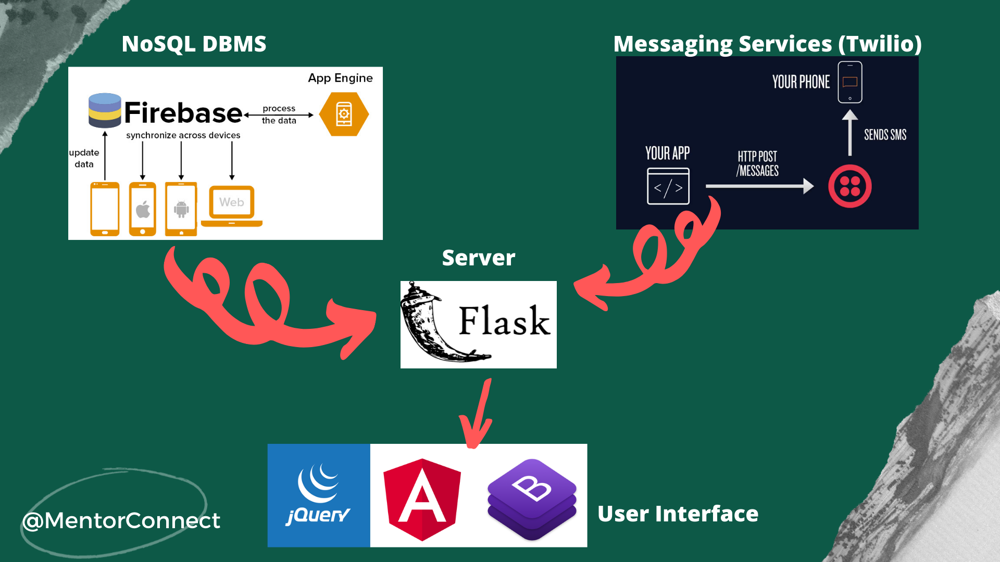
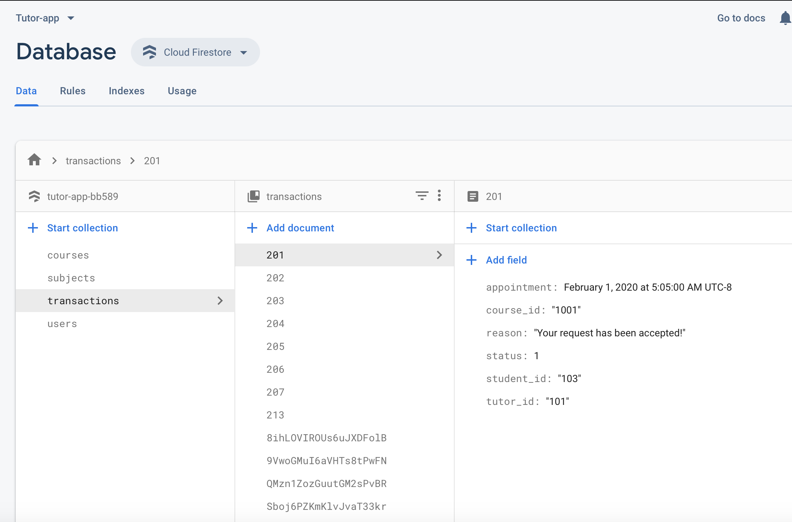

# MentorConnect
Teach & Get taught!

## Inspiration
The "Looking for a tutor" poster near ICS 193 as we were rushing to the lecture on Concurrency Programming. About the poster, it had a phone number to reach out to, if we can teach Calculus. Well, reluctant to call first of all. Awkward to talk about the hourly pays. I am willing to teach my area of expertise but I need help too. So, MentorConnect it is!

## What it does
Students across the university can connect through this app. The user can be both the student and the mentor. 
* Student
   * When a student queries for the course, relevant tutors and their schedules are listed. 
   * Tailored queries for specific usernames or mentor names are also featured.  
   * When the user sends a request, it is added to the notifications tab of the mentor's dashboard. 
   * If the mentor makes a decision, the student receives a text message about the status (Accepted/Rejected) with reasoning. 
   * Once the session date passes, the profile section is updated with past student appointments. 
* Mentor
   * The app lets the mentor update hourly pay, available dates, and relevant information. 
   * When the student books an appointment, the mentor can accept/reject the appointment. 
   * Once the session date passes, the profile section is updated with past mentor appointments. 

## How we built it
We set up the Database system using Firebase and used Flask to communicate. Meanwhile, we created a frontend framework to facilitate UI. We integrated the front end with the back-end. We incorporated Twilio services to facilitate the SMS. 

## Challenges we ran into
* Originally, we had plans of integrating Sketch for UI/UX designs. Upon realizing that it was limited to Mac users, we decided to change our mind to use Angular 8 for the front end. It was new to all of us. Therefore, we faced several issues including integrating an engaging User Interface.
* While setting up the firebase DBMS, we faced incompatibility issues with existing frameworks and firestore.
* While setting up Twilio messaging services, we did not have mobile coverage in the basement and hence was harder to analyze whether we have successfully integrated messaging services. We needed to check the feature on multiple ends. We had to conduct multiple tests to determine the phone numbers we could use for the demo.
* When we finally thought we have mastered front end technologies, we faced issues while integrating date pickers in Angular.

## Accomplishments that we are proud of
We are
* Very satisfied with the User interface that we have come up with within the limited hours.
* Excited that we integrated Twilio's SMS services API.
* Proud of not giving up - when it took a couple of hours to figure out firebase DBMS, when the user interface looked crazy while multiple tutors were registered and the display couldn't be switched to portrait view, when we were running on 3 hours of sleep.

## What we learned
* All of us were not familiar with Angular 8 and firebase DBMS. We were happy to learn and produce an exciting and complete User Interface. With Firebase DBMS, we learned the techniques associated with NoSQL and the contrasts to SQL.
* We are also happy that we took about four hours to finalize the architecture involved and the database schema to be used. This assured that when we did face issues, it was rather programmatic and not with the basic architecture. We were also glad that we communicated our issues well and kept each other motivated throughout the hackathon.

## What’s next for MentorConnect?
* Add ratings to provide a genuine review of the mentor.
* Provide in-app video conferencing possibilities.
* Provide In-built skill tests.
* Provide credits that can be earned by teaching and use the credits to start learning.
